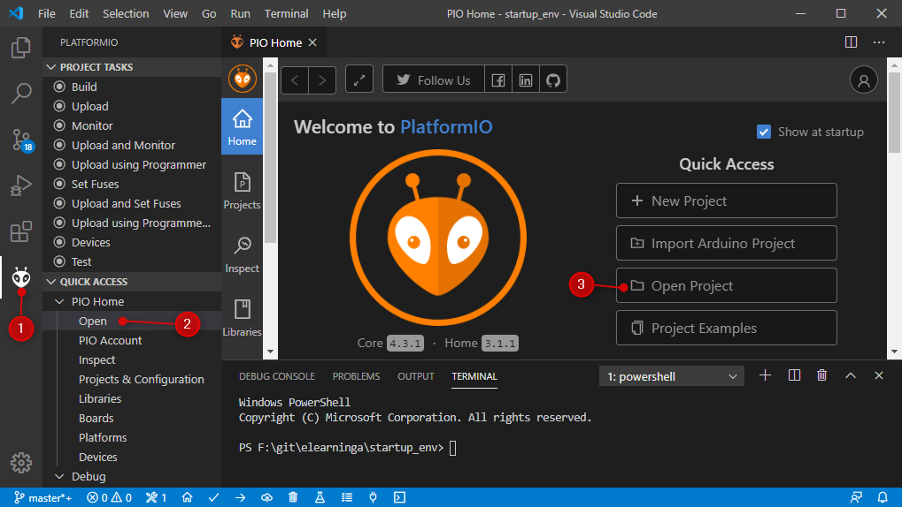
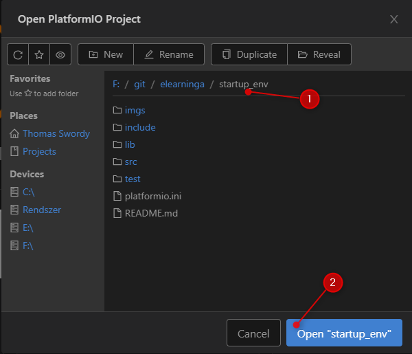
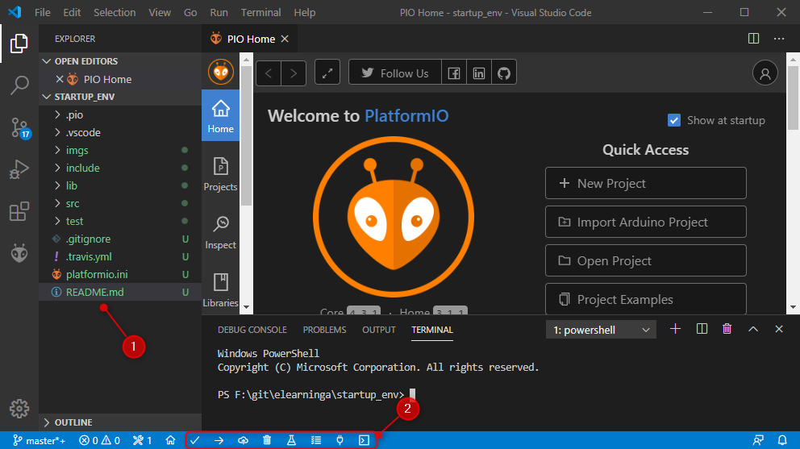
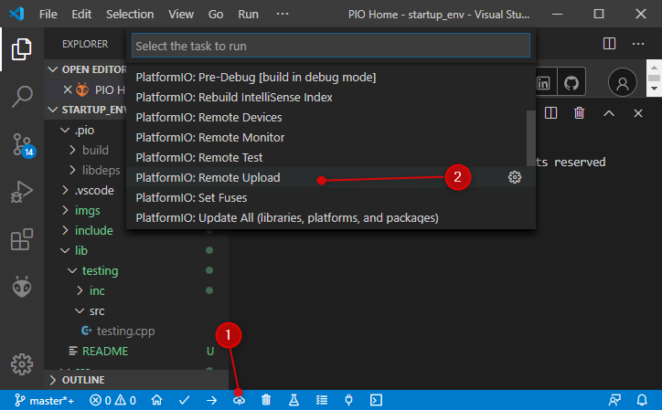
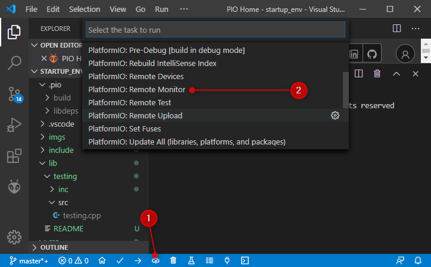
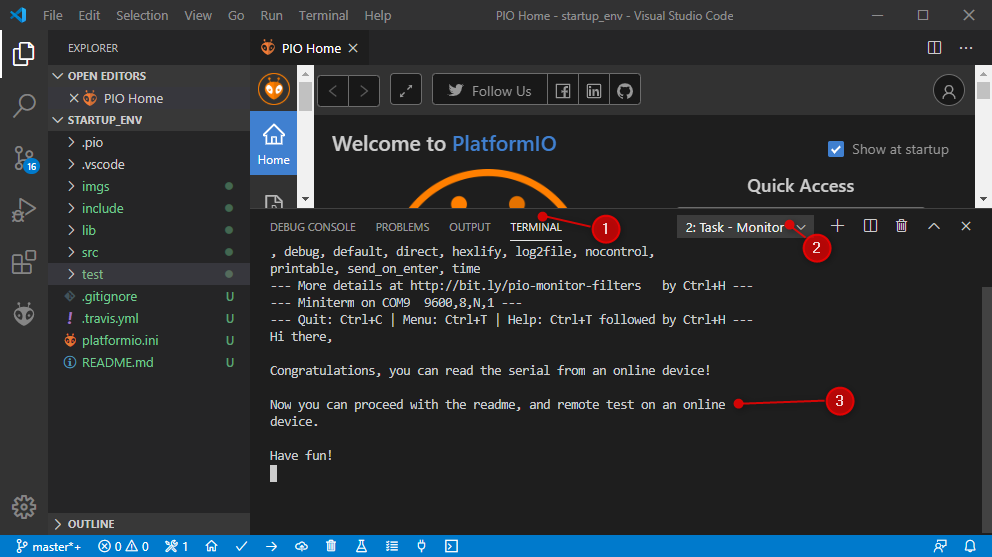
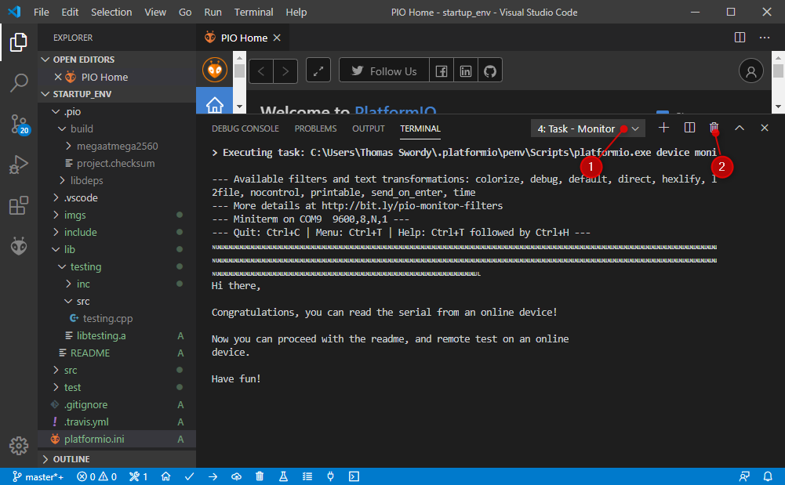
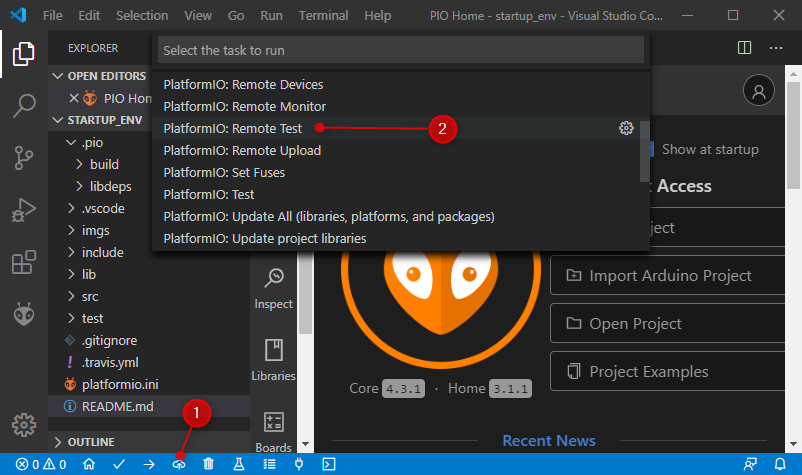
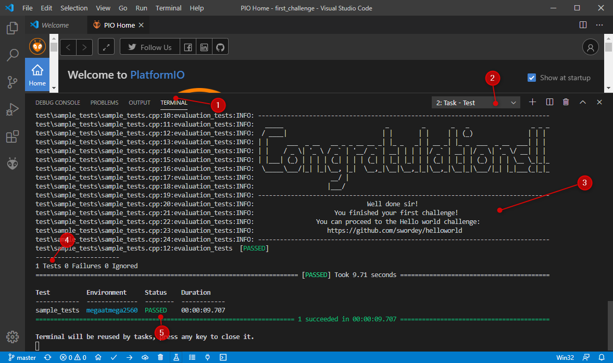

# First Challenge
This is the first challenge of the eLearninga Embedded Challenge Platform.

## Challenge
In this first challenge, you will learn how to use the tools for eLearninga Embedded Challenge Platform (ECP), and learn how to setup your environment to execute C++ code on remote devices.

What you will learn:
* To run a C++ code on an online device, then read the serial monitor.
* To execute a test on the remote device, and review the results.

### Setup the challenge
Steps:
1. Clone git repository
2. Open Visual Studio Code
3. PIO Home Tab / Open project

4. Select the folder of the this git repository and click open

5. If you ended up like this, then you are good to go.

### Upload code to a remote device
1. Upload the code to a remote device (Click `PlatformIO: Upload to remote device` then `PlatformIO: Remote Upload` in the dropdown)

2. Check the serial monitor of the remote device (Click `PlatformIO: Upload to remote device` then `PlatformIO: Remote Monitor` in the dropdown)

3. If you see the following, you did a good job!

4. Close serial monitor

### Do a test on a remote device
1. Do a test on a remote device (Click `PlatformIO: Upload to remote device` then `PlatformIO: Remote test` in the dropdown)

2. The environment is set up correctly, if you see the following text in your terminal

3. Congratulation, you are finished with your first challenge!

## Built With
* [Visual Studio Code](https://code.visualstudio.com/) - Programming IDE
* [PlatformIO](https://platformio.org/) - Ecosystem for Embedded Development

## Next challenge: [Hello world](https://github.com/swordey/helloworld)